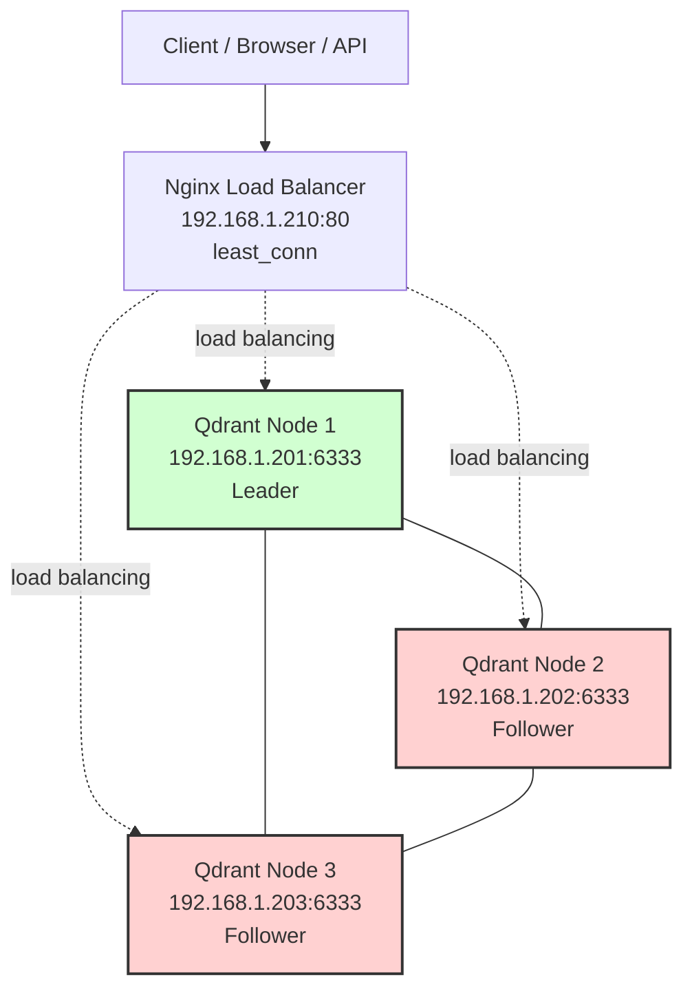

# 🚀🧱 Qdrant Deployment & Cluster Setup Guide

> A complete guide to deploying and managing Qdrant from a single node setup to a full production cluster.

# 🚀 Single Node Deployment

> [https://qdrant.tech/documentation/guides/installation/](https://qdrant.tech/documentation/guides/installation/)

# 🖥️  Configuration

```bash
ssh user@192.168.1.210 
mkdir -p /opt/qdrant/ && cd /opt/qdrant/
nano compose.yaml
```

```yaml
services:
  qdrant:
    image: qdrant/qdrant:latest
    restart: always
    container_name: qdrant
    ports:
      - 6333:6333
      - 6334:6334
    expose:
      - 6333
      - 6334
      - 6335
    configs:
      - source: qdrant_config
        target: /qdrant/config/production.yaml
    volumes:
      - ./qdrant_data:/qdrant/storage

configs:
  qdrant_config:
    content: |
      log_level: INFO
```

```bash
docker compose up -d
docker compose logs -f
docker compose ps
```

---

# 🧱 Cluster Setup

> [https://qdrant.tech/documentation/guides/distributed_deployment/](https://qdrant.tech/documentation/guides/distributed_deployment/)

## 🎯 Recommended Architecture by Scale

| Scale      | Setup    |
| ---------- | -------- |
| Dev        | 1 node   |
| Small Prod | 3 nodes  |
| Medium     | 5 nodes  |
| Large      | 7+ nodes |

## 📊 Example Production Layout

* 3 Qdrant nodes
* 1 Load balancer
* Monitoring (Prometheus + Grafana)
* Snapshot backups to S3

## ℹ️ Cluster Info

| Private IP    | Node  |
| ------------- | ----- |
| 192.168.1.201 | Node1 |
| 192.168.1.202 | Node2 |
| 192.168.1.203 | Node3 |

---

# 🖥️ Node 1 Configuration

```bash
ssh user@192.168.1.201 
mkdir -p ./qdrant/node1 && cd ./qdrant/node1
nano compose.yaml
```

```yaml
services:
  uat_qdrant_node1:
    image: qdrant/qdrant:v1.16.3
    container_name: qdrant_node1
    restart: unless-stopped
    volumes:
      - ./data/node1:/qdrant/storage
    ports:
      - "6333:6333"
      - "6334:6334"
      - "6335:6335"
    environment:
      QDRANT__CLUSTER__ENABLED: "true"
      QDRANT__LOG_LEVEL: "INFO"
      QDRANT__CLUSTER__P2P__PORT: "6335"
      QDRANT__SERVICE__ENABLE_GRPC: "true"
      QDRANT__STORAGE__ON_DISK_PAYLOAD: "true"
      QDRANT__STORAGE__SNAPSHOT__ENABLE: "true"
      #QDRANT__SERVICE__API_KEY: "8f9a2d7b-3c4e-4f01-9b56-7d1a23e8c5f9"
    command: >
      ./qdrant
      --uri http://192.168.1.201:6335
    healthcheck:
      test: ["CMD-SHELL", "pidof qdrant || exit 1"]
      interval: 10s
      timeout: 5s
      retries: 3
      start_period: 10s
    logging:
      driver: "json-file"
      options:
        max-size: "100m"
        max-file: "5"
        compress: "true"
```

```bash
docker compose up -d
docker compose logs -f
docker compose ps
```

---

# 🖥️ Node 2 Configuration

```bash
ssh user@192.168.1.202
mkdir -p ./qdrant/node2 && cd ./qdrant/node2
nano compose.yaml
```

```yaml
services:
  uat_qdrant_node2:
    image: qdrant/qdrant:v1.16.3
    container_name: qdrant_node2
    restart: unless-stopped
    ports:
      - "6333:6333"
      - "6334:6334"
      - "6335:6335"
    volumes:
      - ./data/node2:/qdrant/storage
    environment:
      QDRANT__CLUSTER__ENABLED: "true"
      QDRANT__LOG_LEVEL: "INFO"
      QDRANT__CLUSTER__P2P__PORT: "6335"
      QDRANT__SERVICE__ENABLE_GRPC: "true"
      QDRANT__STORAGE__ON_DISK_PAYLOAD: "true"
      QDRANT__STORAGE__SNAPSHOT__ENABLE: "true"
      #QDRANT__SERVICE__API_KEY: "8f9a2d7b-3c4e-4f01-9b56-7d1a23e8c5f9"
    command: >
      ./qdrant
      --bootstrap http://192.168.1.201:6335
      --uri http://192.168.1.202:6335
    healthcheck:
      test: ["CMD-SHELL", "pidof qdrant || exit 1"]
      interval: 10s
      timeout: 5s
      retries: 3
      start_period: 10s
    logging:
      driver: "json-file"
      options:
        max-size: "100m"
        max-file: "5"
        compress: "true"
```

```bash
docker compose up -d
docker compose logs -f
docker compose ps
```

---

# 🖥️ Node 3 Configuration

```bash
ssh user@192.168.1.203
mkdir -p ./qdrant/node3 && cd ./qdrant/node3
nano compose.yaml
```

```yaml
services:
  uat_qdrant_node3:
    image: qdrant/qdrant:v1.16.3
    container_name: qdrant_node3
    restart: unless-stopped
    ports:
      - "6333:6333"
      - "6334:6334"
      - "6335:6335"
    volumes:
      - ./data/node3:/qdrant/storage
    environment:
      QDRANT__CLUSTER__ENABLED: "true"
      QDRANT__LOG_LEVEL: "INFO"
      QDRANT__CLUSTER__P2P__PORT: "6335"
      QDRANT__SERVICE__ENABLE_GRPC: "true"
      QDRANT__STORAGE__ON_DISK_PAYLOAD: "true"
      QDRANT__STORAGE__SNAPSHOT__ENABLE: "true"
      #QDRANT__SERVICE__API_KEY: "8f9a2d7b-3c4e-4f01-9b56-7d1a23e8c5f9"
    command: >
      ./qdrant
      --bootstrap http://192.168.1.201:6335
      --uri http://192.168.1.203:6335
    healthcheck:
      test: ["CMD-SHELL", "pidof qdrant || exit 1"]
      interval: 10s
      timeout: 5s
      retries: 3
      start_period: 10s
    logging:
      driver: "json-file"
      options:
        max-size: "100m"
        max-file: "5"
        compress: "true"
```

```bash
docker compose up -d
docker compose logs -f
docker compose ps
```

---

# 🧠 Validate Cluster Health

```bash
curl http://<any-node>:6333/cluster | jq
curl http://localhost:6333/cluster | jq

curl http://<any-node>:6333/cluster | jq '.result.raft_info'
curl http://localhost:6333/cluster | jq '.result.raft_info'
```

---

# 🔄 SAFE Restart Strategy (Zero Downtime)

* Restart node 1
* Restart node 2
* Restart Leader LAST

## ❌ NEVER DO THIS

```bash
docker compose down
```

## ❌ NEVER STOP 2 NODES

If you stop 2 nodes:

* Only 1 node left
* No quorum
* Writes fail
* Cluster frozen

---

# 📦 Create a Collection

```bash
curl -X PUT "http://localhost:6333/collections/test_collection" \
  -H "Content-Type: application/json" \
  -d '{
        "vectors": {
          "size": 4,
          "distance": "Cosine"
        },
        "shard_number": 3,
        "replication_factor": 2
      }'
```

---

# ✅ Verify Collections

```bash
curl -s http://localhost:6333/collections | jq
curl http://localhost:6333/collections/test_collection | jq
http://192.168.1.201:6333/dashboard
http://192.168.1.202:6333/dashboard
http://192.168.1.203:6333/dashboard
```

---

# ⚙️ NGINX Configuration (`nginx.conf`)

```bash
ssh user@192.168.1.210 
mkdir -p ./qdrant-nginx/ && cd ./qdrant-nginx/
nano nginx.conf
```

```nginx
worker_processes auto;

events {
    worker_connections 1024;
}

http {
    upstream qdrant_cluster {
        least_conn;

        server 192.168.1.201:6333 max_fails=3 fail_timeout=10s;
        server 192.168.1.202:6333 max_fails=3 fail_timeout=10s;
        server 192.168.1.203:6333 max_fails=3 fail_timeout=10s;
    }

    server {
        listen 80;

        location / {
            proxy_pass http://qdrant_cluster;
            proxy_http_version 1.1;

            proxy_set_header Host $host;
            proxy_set_header X-Real-IP $remote_addr;
            proxy_set_header X-Forwarded-For $proxy_add_x_forwarded_for;

            proxy_connect_timeout 5s;
            proxy_send_timeout 60s;
            proxy_read_timeout 60s;

            proxy_next_upstream error timeout http_502 http_503 http_504;
        }
        location /info {
            alias /usr/share/nginx/html/index.html;
            default_type text/html;
        }
    }
}
```

## 👁️‍🗨️ Cluster View
```bash 
nano index.html
```
```html
<!DOCTYPE html>
<html>
<head>
  <title>Qdrant Cluster Overview</title>
  <style>
    table { border-collapse: collapse; width: 60%; margin: 20px auto; }
    th, td { border: 1px solid #333; padding: 8px 12px; text-align: center; }
    th { background-color: #555; color: #fff; }
    tr.leader { background-color: #d1ffd1; }
    tr.follower { background-color: #ffd1d1; }
  </style>
</head>
<body>
  <h2 style="text-align:center;">Qdrant Cluster Overview</h2>
  <table id="cluster-table">
    <thead>
      <tr>
        <th>Node IP</th>
        <th>Peer ID</th>
        <th>Role</th>
        <th>Leader Peer ID</th>
      </tr>
    </thead>
    <tbody></tbody>
  </table>

  <script>
    const nodes = [
      "http://192.168.1.201:6333",
      "http://192.168.1.202:6333",
      "http://192.168.1.203:6333"
    ];

    const tbody = document.querySelector("#cluster-table tbody");

    nodes.forEach(node => {
      fetch(`${node}/cluster`)
      .then(res => res.json())
      .then(data => {
        const result = data.result;
        const role = result.raft_info.role;
        const leader = result.raft_info.leader;
        const peerId = result.peer_id;

        const tr = document.createElement("tr");
        tr.className = role.toLowerCase();
        tr.innerHTML = `
          <td>${node.replace("http://", "")}</td>
          <td>${peerId}</td>
          <td>${role}</td>
          <td>${leader}</td>
        `;
        tbody.appendChild(tr);
      })
      .catch(err => {
        const tr = document.createElement("tr");
        tr.innerHTML = `
          <td colspan="4">Error connecting to ${node}: ${err}</td>
        `;
        tbody.appendChild(tr);
      });
    });
  </script>
</body>
</html>
```

## 🐳 NGINX Docker Service
```bash
nano compose.yaml
```
```yaml
services:
  qdrant-nginx:
    image: nginx:latest
    container_name: qdrant-nginx
    restart: unless-stopped
    ports:
      - "80:80"
    volumes:
      - ./nginx.conf:/etc/nginx/nginx.conf:ro
      - ./index.html:/usr/share/nginx/html/index.html:ro
```

```bash
docker compose up -d
docker compose logs -f
docker compose ps

http://192.168.1.210/cluster
http://192.168.1.210/dashboard
http://192.168.1.210/info
```

## 📊 3-node Qdrant cluster behind Nginx.



## 🌐 Access Services using IP or localhost

* Qdrant API: [http://localhost:6333](http://localhost:6333)
* Qdrant Dashboard: [http://localhost:6333/dashboard](http://localhost:6333/dashboard)
* Qdrant Cluster: [http://localhost:6333/cluster](http://localhost:6333/cluster)
* Qdrant Cluster Health: curl [http://localhost:6333/healthz](http://localhost:6333/healthz)
* API references: [https://api.qdrant.tech/api-reference](https://api.qdrant.tech/api-reference)


---
## 📝 License

This guide is provided as-is for educational and professional use.

## 🤝 Contributing
Feel free to suggest improvements or report issues via pull requests or the issues tab.

## 💼 Connect with Me 👇😊

*   🔥 [**YouTube**](https://www.youtube.com/@DevOpsinAction?sub_confirmation=1)
*   ✍️ [**Blog**](https://ibraransari.blogspot.com/)
*   💼 [**LinkedIn**](https://www.linkedin.com/in/ansariibrar/)
*   👨‍💻 [**GitHub**](https://github.com/meibraransari?tab=repositories)
*   💬 [**Telegram**](https://t.me/DevOpsinActionTelegram)
*   🐳 [**Docker Hub**](https://hub.docker.com/u/ibraransaridocker)

### ⭐ If You Found This Helpful...

***Please star the repo and share it! Thanks a lot!*** 🌟
